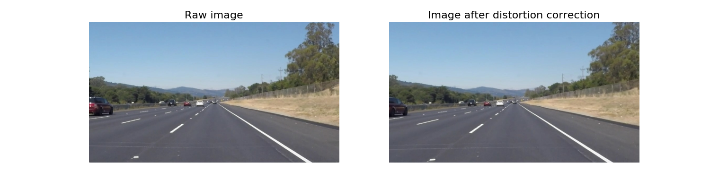
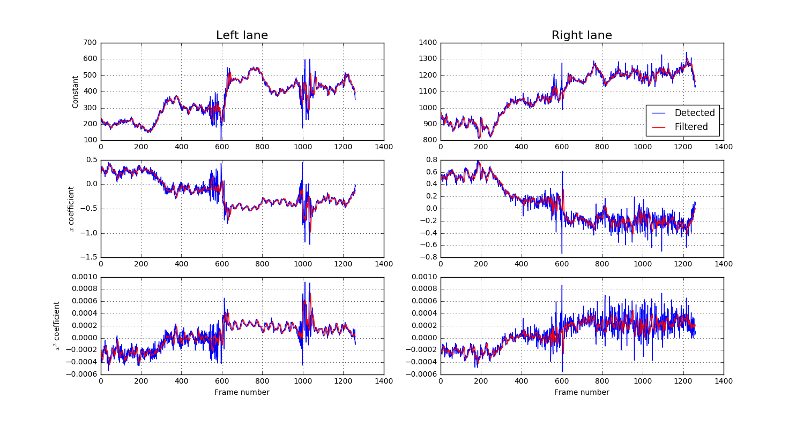

# Lane finding pipeline

The [Python notebook](Project.ipynb) in this repository contains a pipeline for identifying lane markings in video frames.  The main stages in this process are:

 - Camera calibration, and removal of camera distortion effects from the raw video frames;
 - Perspective transform, to create a top-down view of the road;
 - Colour transforms, thresholding and edge detection, to create binary images that indicate where the lane lines are;
 - Clustering, to separate the left and right lane markings;
 - Quadratic line fitting onto the detected lane markings;
 - Error checking and filtering, to make the pipeline robust to noisy input images; and
 - Final annotation of the video to indicate where the lane is in the image.

## Pipeline

### Camera calibration
The code in `calibrate_camera` uses a chessboard image to compute camera distortion coefficients for use when processing each frame of the input video.  I used two functions from the OpenCV library to achieve this:

 - `findChessboardCorners` - since the number of chessboard corners is unknown, I call this with different values for the pattern size until it returns successfully;
 - `calibrateCamera` - this compares the corners identified in the image with `objPoints`, an array of real-world coordinates for each corner in the chessboard.

I applied this function to the first chessboard image, which fills the frame and therefore provides the most robust set of distortion coefficients.  The images below show some of the chessboard images before and after applying `cv2.undistort` to remove the effect of camera distortion.

### Distortion correction

The function `undistort_img` uses the coefficients obtained during calibration to correct for camera distortion on each input frame.  The images below show the effect on a sample frame.

### Perspective transform

I chose to perform a perspective transform as the next stage to create a birds-eye view of the road.  This transforms the lane lines to make them closer to vertical, making them easier to find using edge-detection in the next stage.

The image below shows a sample frame containing a straight section of road annotated with a polygon covering part of the lane.

By identifying the corners of this polygon in the image coordinates, `src`, and mapping them to a rectangle `dst` using the OpenCV function `getPerspectiveTransform`, I obtained matrices for warping and unwarping each image frame to and from the birds-eye perspective.  

| src           | dst           |
|---------------|---------------|
| `[205, 720]`  | `[205, 720]`  |
| `[1131, 720]` | `[1131, 720]` |
| `[821, 523]`  | `[1131, 475]` |
| `[479, 523]`  | `[205, 475]`  |

After the perspective transform, the sample image looks like this:

### Colour transforms and edge detection

The goal of this stage is to create a binary image that identifies the lane markings.  I used the following three steps to achieve this:

 1. Noting that the yellow and white lane markings are most clearly visible in the R, G, S and V colour channels, I created a new single-channel image that is simply the average of these four channels using the code `np.mean(color_channels(img, channels=['r','g','s','v']), axis=2)`.
 2. I then used the function `abs_sobel_thresh` to apply a Sobel filter and detect edges within the image, returning a binary image from the points in the range [10, 255].
 3. To remove lines not associated lane markings, I thresholded the RGSV image from step 1 with point values greater than 150, then used AND logic to combine this with the result from step 2.

The sequence of images below illustrates this process.  The lane markings can clearly be identified in the final binary images.

### Clustering and polynomial curve fitting

I found that the [K means clustering algorithm](http://scikit-learn.org/stable/modules/generated/sklearn.cluster.KMeans.html) implemented in Scikit-learn provides a very straight-forward way to separate the points belonging to the left and right lane lines.  This is done by the line `km = KMeans(2).fit(X_rescaled)` within the `find_lanes_clustering` function.  Re-scaling the y-coordinates first allows K means to cope better where the clusters are much longer in the vertical direction than horizontally.

Next the `fit_lanes` function computes a quadratic fit for each cluster of points.  By using a [RANSAC regression](http://scikit-learn.org/stable/modules/generated/sklearn.linear_model.RANSACRegressor.html) this is robust to outlying points, e.g. from noise in the input image or other marks on the road surface.  The quadratic terms will later allow the radius of curvature to be computed.

The following images show each cluster of points in red and green, and the fitted quadratic line in blue.

### Optimisations

I made the following optimisations when implementing the complete pipeline for processing video input:

 - Reorganising the code into the classes `Line` and `LaneDetector`.  This makes it easier to keep track of the history of the lines, and implement the improvements below.
 - Adding the `find_lanes_fast` function.  When a lane line has been detected in a previous frame, this function simply searches for points either side of this previous line rather than running the K-means clustering again.  This improves speed.  If this function fails to find a robust line fit, the pipeline will fall back to the `find_lanes_clustering` function.
 - Adding a low-pass filter in the `Line` class.  By passing each of the quadratic coefficients through a [Butterworth filter](https://docs.scipy.org/doc/scipy/reference/generated/scipy.signal.butter.html), the pipeline is more robust to erroneous line detection in individual frames.  I found this to be a critical feature when running the pipeline on the challenge video.
 - Adding error checking to the detected lines.  Spurious lines can be detected, for instance if the lane width is too narrow or too wide (I used the range [2, 4] metres), and whether the top of the lane is much wider or narrower than the bottom.  When the code detects an error, it falls back on the next prediction from the low-pass filter until the next good image frame.

The charts below show the effect of the low-pass filter with a cut-off frequency of 1Hz on the quadratic coefficients detected in the project video.  The blue lines are the values detected from the image frames, while the red lines are the smoothed values output from the filter.  The effect is to reduce flickering/wobbling in the final video output.

### Lane measurements

Assuming the lane width to be 3.7m, I added methods to the `Line` class to compute the radius of curvature and the intercept of each line, both at the base of the image.

The `LaneDetector` class then uses the following lines of code to compute the average radius of curvature of both lines, and compare the centre of the detected lane with the centre of the image in order to work out the offset of the car from the lane centre.

	r_curvature = 0.5 * (self.left_line_filtered.radius_of_curvature() +
						self.right_line_filtered.radius_of_curvature())
	lane_centre = 0.5 * (self.right_line_filtered.intercept() +
						self.left_line_filtered.intercept())
	centre_offset = 0.5 * self.settings['shape'][0] / self.settings['pixels_per_metre'] - \
					lane_centre

### Image annotations

Finally, the `update` method of `LaneDetector` draws a polygon representing the detected lane, reverses the perspective transform and superimposes this onto the original undistorted image frame along the measurements.  An example output frame looks like this:

## Performance on video input

### project_video.mp4

The video result is [here](output_images/project_video.mp4).  The pipeline produces stable lane detection throughout the video, along with reasonable values for the curvature and centre offset.

### challenge_video.mp4

The result from the challenge video is [here](output_images/challenge_video.mp4).  The lanes are harder to identify against the lighter road surface, and so the first annotated image does not appear until several frames into the video when a good detection is made.  There is also some wobble at the top of the lane, where the lines are faint against the road surface.

## Discussion

There are two main issues with the pipeline as implemented here:

 - The thresholding and gradient detection parameters used to find the lanes work well on videos with clearly defined white and yellow lines taken in good lighting conditions on a dark road surface.  However it fails when this is not the case, for instance as in the second, harder challenge video.
 - If the speed of the car should change, it is likely that the low-pass filter would need adjustment, as the expected line positions would be changing faster or slower.

Some potential improvements could address these issues:

 - Pre-process the images to correct brightness and contrast for different lighting conditions.
 - Try to identify different lighting and road surface conditions, and adjust the line detection parameters accordingly.
 - Build several pipelines to find lanes via different techniques, and then form a consensus from the output of the different methods.  Other techniques could include:
	 - A deep learning model to predict steering angles from the video data.  This could then predict the lane curvature.
	 - GPS and map data could provide an expected lane curvature given the car's position and direction.
 - Adjust the filter cut-off frequency according to the car's measured speed.
